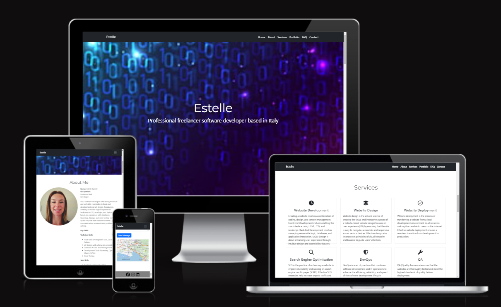
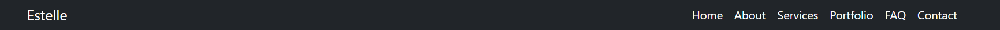
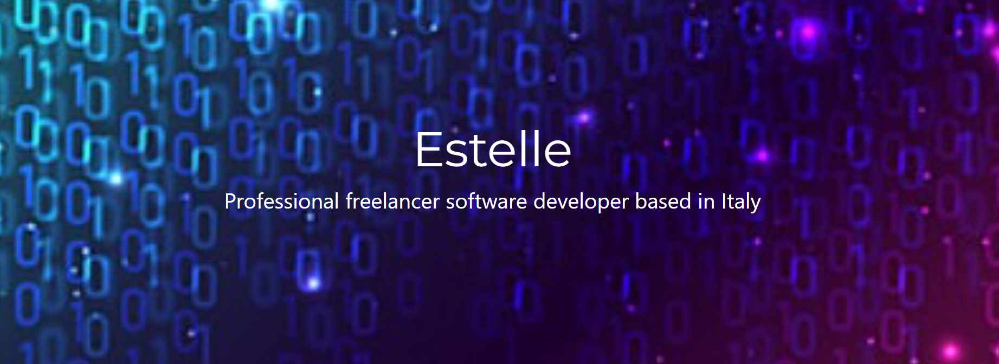
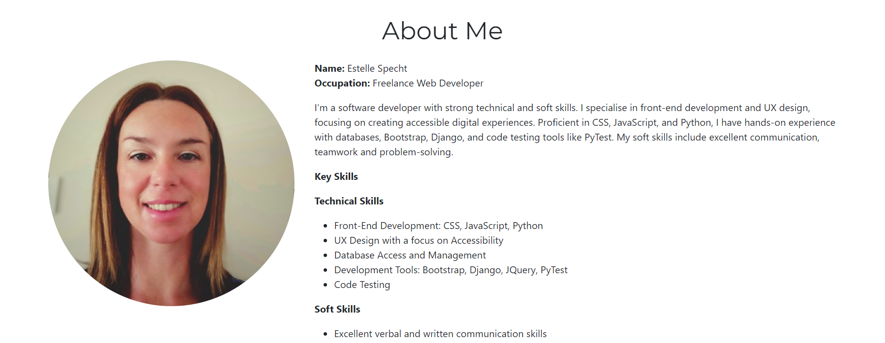
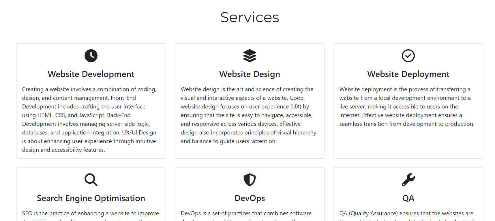
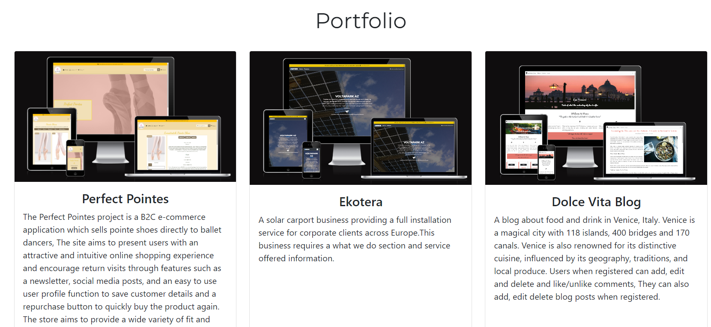
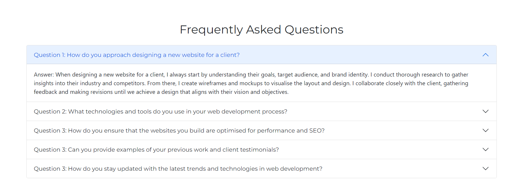
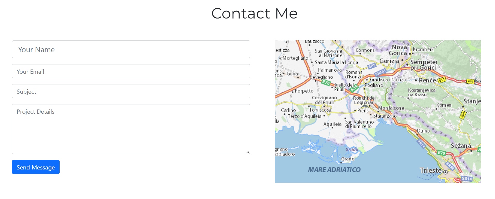

# Portfolio

This is a portfolio website showcasing my latest projects and information about me and how to get in touch.

## Portfolio Project

[Live Site](https://estii20.github.io/portfolio/#portfolio)

[Website Mock-up](https://ui.dev/amiresponsive?url=https://estii20.github.io/portfolio/#portfolio)

## Table of contents

- [UX Design](#ux-design)
- [Features](#features)
- [Languages Used](#languages-used)
- [Frameworks, Libraries and Programs Used](#frameworks-libraries-and-programs-used)
- [Testing](#testing)
- [Technologies Used](#technologies-used)
- [Deployment and Publishing](#deployment-and-publishing)
- [Resources](#resources)
- [Credits](#credits)
- [Acknowledgements](#acknowledgements)

### UX Design

A clean professional look that combines a simple navigation so that the user can locate the information they require.

### Features

Navbar

Hero image

About Section

Services Section

Portfolio Section

FAQs Section

Contact Section

Footer 

### Languages Used

- HTML5
- CSS3

### Frameworks, Libraries and Programs Used

- [Google Fonts](https://fonts.google.com/) used for the fonts.
- [Font Awesome](https://fontawesome.com/) was used to add icons for aesthetic and UX purposes.
- [Git](https://git-scm.com/) was used for version control by utilising the Gitpod terminal to commit to Git and Push to GitHub.
- [GitHub](https://github.com/)  is used as the repository for the project code after being pushed from Git.
- [Django](https://www.djangoproject.com/) was used as the framework to support rapid and secure development of the application.
- [Bootstrap](https://getbootstrap.com/) was used to build responsive web pages
- [GitPod](https://gitpod.io/) IDE used to complete the project.

### Testing

Browser Compatibility PASSED

Browser Compatibility checks were run using BrowserStack and my computer. The results are:

Firefox - ☑

Chrome - ☑

Opera - ☑

Microsoft Edge - ☑

Safari - ☑

__Accessibility Testing__

From using Lighthouse I was able to check the accessibility and SEO of the website. 

By utilising this in DevTools I was able to generate reports for both desktop and mobile. By analysing these reports I was able to make alterations in both the HTML and CSS code to improve the accessibility of the application.

Navigation Testing

 - Mobile/Tablet Menu PASSED
 - The hamburger menu icon is visible and functions
 - Appropriate links are shown/hidden depending on user
 - All text and icons are visible and appropriate sizes
 - All navigation links successfully direct the user to corresponding pages
 - Desktop Menu PASSED
 - All links highlight and apply intended CSS
 - Appropriate links are shown/hidden depending on user
 - All text and icons are visible and appropriate sizes
 - All navigation links successfully direct the user to corresponding pages
 - Menu successfully opens and closes on press/click
 - All buttons lead to corresponding pages

### Technologies Used

# Resources

[Bootstrap 5 documentation](https://getbootstrap.com/docs/4.6/getting-started/introduction/)

[Favicon](https://favicon.io/) to generate the favicon.

### Deployment and Publishing

- Forking and Cloning
To work on your own copy of the code, follow these steps for forking and cloning via GitHub:
In the repository, locate the 'Fork' button at the top right-hand side, adjacent to 'Star'. Click on it to create a new repository, forked from the original.

- To clone the repository, you have two options:
Within the repository, click on the 'Code' dropdown located next to 'Add File' on the right (underneath the Settings tab). From there, choose the option to download all files and save a local copy.
Alternatively, within the same 'Code' dropdown, opt to open the code with GitHub Desktop and proceed with your work from there.

### Resources

### Credits

### Acknowledgements